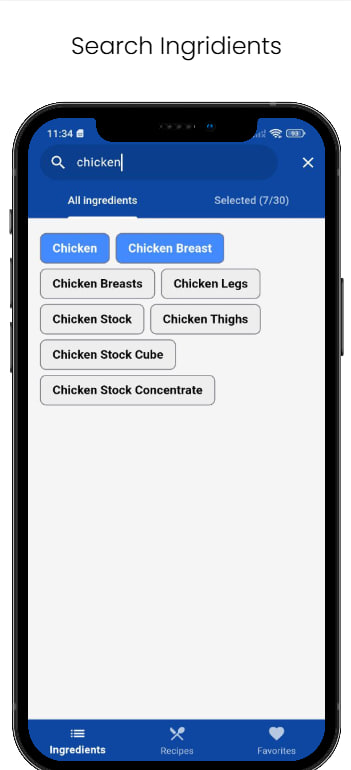
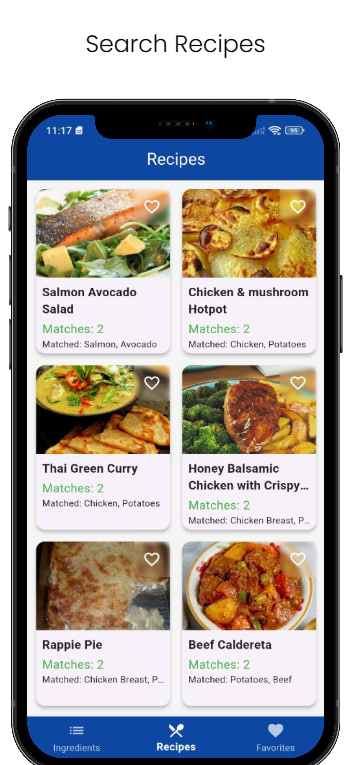
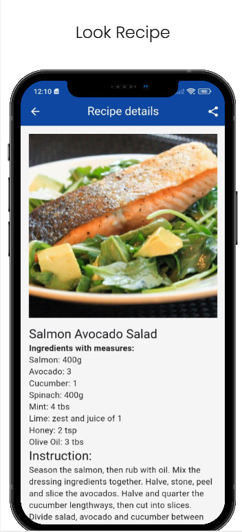
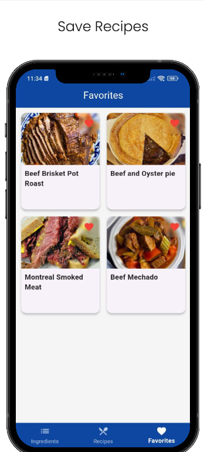

# Pantry Chef

Pantry Chef is a Flutter application designed to help users find recipes based on the ingredients they have. The app provides a user-friendly interface to select ingredients, view recipes, and manage favorites.

## Features

- **Ingredient Selection**: Users can select ingredients they have from a comprehensive list.
- **Recipe Search**: The app fetches recipes based on the selected ingredients.
- **Recipe Details**: Detailed view of each recipe including ingredients, instructions, and category.
- **Favorites**: Users can mark recipes as favorites for quick access.
- **Offline Support**: The app caches data for offline access.
- **Share Recipes**: Users can share recipes with others.
- **Connectivity Check**: The app checks for internet connectivity and handles offline scenarios gracefully.

## Screenshots






## Getting Started

### Prerequisites

- Flutter SDK
- Dart SDK

### Installation

1. Clone the repository:
   ```sh
   git clone https://github.com/yourusername/pantry_chef.git
   ```
2. Navigate to the project directory:
   ```sh
   cd pantry_chef
   ```
3. Install dependencies:
   ```sh
   flutter pub get
   ```

### Running the App

To run the app on an emulator or physical device, use the following command:
```sh
flutter run
```

### Building for Release

To build the app for release, use the following command:
```sh
flutter build apk
```

## Project Structure

- **lib**: Contains the main Dart code for the application.
  - **presentation**: UI components and screens.
  - **domain**: Business logic and use cases.
  - **data**: Data sources and repositories.
  - **core**: Core utilities and constants.
  - **di**: Dependency injection setup.

## Technologies and Libraries

- **Architecture**: The project follows a clean architecture approach, separating the application into presentation, domain, and data layers.
- **State Management**: The app uses `flutter_riverpod` for state management.
- **Dependency Injection**: `get_it` is used for dependency injection.
- **Networking**: `dio` is used for making network requests.
- **Local Storage**: `hive` and `hive_flutter` are used for local storage.
- **Image Loading**: `cached_network_image` is used for efficient image loading and caching.
- **Connectivity**: `connectivity_plus` is used to check internet connectivity.
- **Sharing**: `share_plus` is used for sharing recipes.
- **URL Launching**: `url_launcher` is used for launching URLs.


